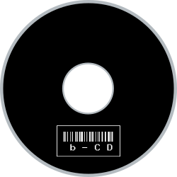

# b-CD
A barcode-scanner based audio player.

CDs are soon getting obsolete with the increasing use of streaming services. Anyway, if you still like to browse through your CD collection in real life and let others explore it in an easy way, just grab a barcode scanner and have fun!

b-CD is an application that runs in your terminal with a very basic curses GUI. At the current state it is used to play random tracks from a CD. You can off course map the music to any item in your room - After all, there are just any kind of barcode. 

## Setup
In order to use the program, you have to put the path to your music root directory into the accessories.py at the `music_dir` variable. You should rip your CDs and put the them structured into different subfolders at this location. OGG works best, since the pygame library sometimes cannot handle MP3 files well.

You\`ll need to have python installed and you can use `pip install` for the dependencies mentioned below.

In order to do the mapping from barcode to album, you have to create a file named `barcode` in each folder that you want to include in the library. At startup, all folders beginning with your root folder will be crawled and the barcodes will be put into a file at your current terminal location, which is automatically used by the program as a mapping file.

Now you are good to go!

## TODO
- Playlist
- Hotkey Thread
- Resize Handling
- Split Song and Band

### Dependencies
- pygame
- pyttsx
